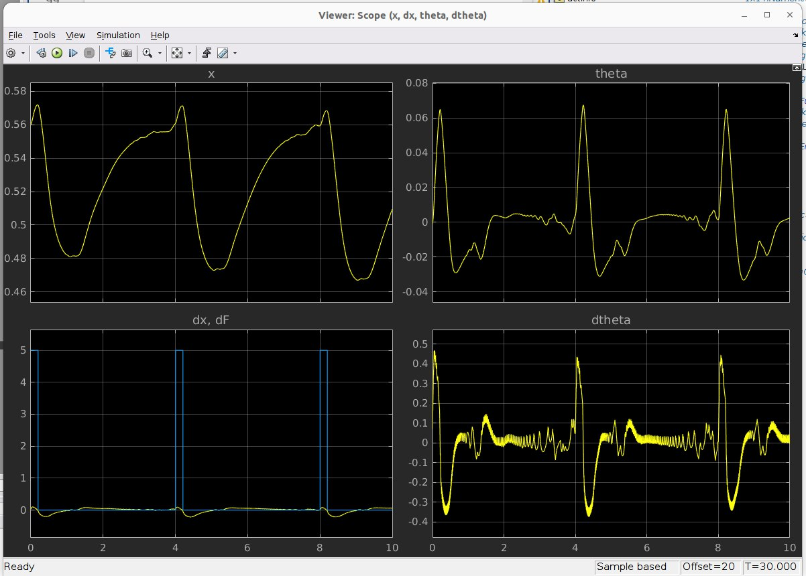
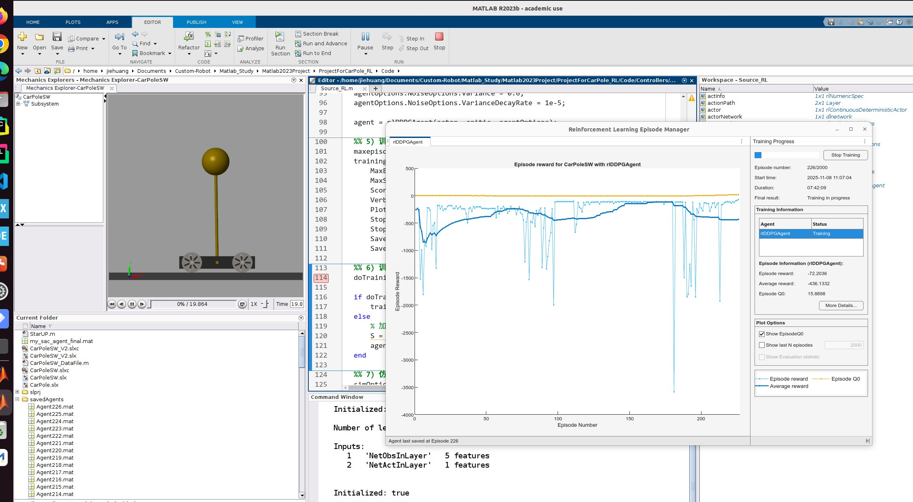

# 倒立摆小车强化学习项目

基于MATLAB/Simulink的倒立摆强化学习训练项目。小车模型由SolidWorks设计并导入Simulink仿真。

## 环境要求

- MATLAB R2023b
- Simulink + Simscape Multibody
- Reinforcement Learning Toolbox
- Ubuntu 22.04 

## 使用方法

### 训练模式

在训练脚本中设置 `doTraining = true`，然后运行：

**训练脚本1: RL.m**
```matlab
% 在RL.m中设置: doTraining = true
run('Controllers/RL.m')
```
- 对应环境: `CarPole.slx` (Simscape搭建的基础模型)

**训练脚本2: RL_SAC.m**
```matlab
% 在RL_SAC.m中设置: doTraining = true
run('Controllers/RL_SAC.m')
```
- 对应环境: `CarPoleSW_V2.slx` (添加了位置和角度约束的环境)
- 使用SAC算法
- 训练结果: `my_sac_agent_final.mat`

**训练脚本3: Source_RL.m**
```matlab
% 在Source_RL.m中设置: doTraining = true
run('Controllers/Source_RL.m')
```
- 对应环境: `CarPoleSW.slx` (SolidWorks导入的模型)
- 训练结果: `Agent238.mat`
- 可在代码中更改模型

### 测试模式

在训练脚本中设置 `doTraining = false`，然后运行对应脚本即可测试已训练的Agent。

## 训练与环境对应关系

| 训练脚本 | 仿真环境 | 训练结果 | 说明 |
|---------|---------|---------|------|
| `RL.m` | `CarPole.slx` | - | Simscape基础模型 |
| `RL_SAC.m` | `CarPoleSW_V2.slx` | `my_sac_agent_final.mat` | SAC算法，带位置和角度约束 |
| `Source_RL.m` | `CarPoleSW.slx` | `Agent238.mat` | 可在代码中更改模型 |

## 仿真环境说明

### CarPole.slx
- Simscape物理建模搭建
- 训练速度快
- 适合算法验证

### CarPoleSW.slx
- SolidWorks三维模型导入
- 真实物理参数
- 更接近实际系统

### CarPoleSW_V2.slx
- 添加了位置和角度约束的环境
- 包含位置惩罚机制
- 包含终止条件
- 训练效率更高

## 已训练的Agent

**SAC训练结果:**
- 文件: `Code/my_sac_agent_final.mat`
- 训练脚本: `RL_SAC.m`
- 对应环境: `CarPoleSW_V2.slx`

**Source_RL训练结果:**
- 文件: `savedAgents/Agent238.mat`
- 训练脚本: `Source_RL.m`
- 对应环境: `CarPoleSW.slx`
- 
- 
