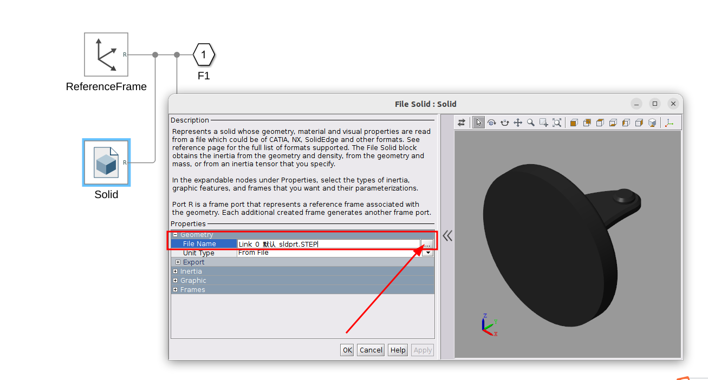
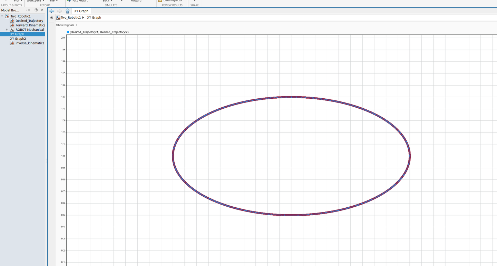
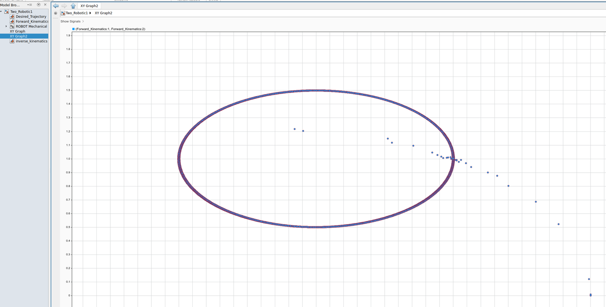
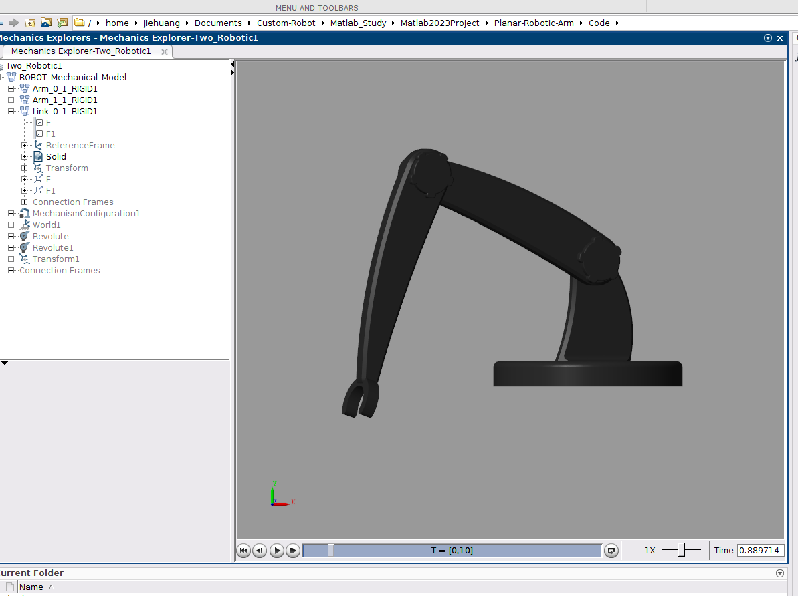

# 2轴平面机械臂

机械臂模型由SolidWorks设计并导入Simulink仿真。

## 环境要求

- MATLAB R2023b
- Simulink + Simscape Multibody
- Reinforcement Learning Toolbox
- Ubuntu 22.04

## 使用方法

### 1、修改模型加载路径

双击 `Two_Robotic1.slx`，打开simulink仿真环境。

修改`Link_0_1_RIGID1`，`Arm_0_1_RIGID1`，`Arm_1_1_RIGID1`的实体路径

### 2、run

运行仿真环境

## 仿真结果

### 期望结果
- 

### 正运动结果
- 

### 仿真模型
- 

> **参考教程：**
>
> * [The Full Modeling and simulation of a Robotic Arm using MATLAB simscape multibody and Solidworks](https://www.youtube.com/watch?v=pDiwAA1cnb0)
> * [用Solidworks对机械臂进行建模并用simscape插件将模型导入到MATLAB中进行仿真](https://www.bilibili.com/video/BV1rC4y1K7mo/?spm_id_from=333.788.recommend_more_video.-1&trackid=web_related_0.router-related-2206146-trbxs.1762842355633.723&vd_source=c22c0bdbee7d0f45e072fba519a4b9f1)
> * [Matlab2023b平面机械臂PID控制（Linux）](https://zhuanlan.zhihu.com/p/1971589266770461205)
